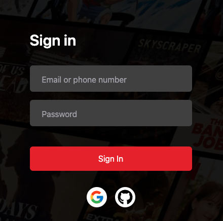

This is a [Next.js](https://nextjs.org/) project bootstrapped with [`create-next-app`](https://github.com/vercel/next.js/tree/canary/packages/create-next-app).

## Getting Started

First, run : 
```
npm install
npm run dev
```
WIP 14/7


this project using noSQL database : Mongodb. 
You need to setup locally or setup using Atlas.
Edit login setting in <strong>.env</strong> file, then run migrate:

```
npx prisma db push
```
# Custom
## Add Google & GitHub OATH 



install these packages :
```
npm install react-icons
npm install @next-auth/prisma-adapter
```

import icons and paste in tsx:
```
import { FcGoogle } from "react-icons/fc";
import { FaGithub } from "react-icons/fa";
```

in your .env file should exist :
```dotenv
GITHUB_ID=
GITHUB_SECRET=

GOOGLE_CLIENT_ID=
GOOGLE_CLIENT_SECRET=
```

in <strong>pages/api/auth/[...nextauth].ts</strong> also
```typescript
    providers: [
    GithubProvider({
        clientId: process.env.GITHUB_ID || '',
        clientSecret: process.env.GITHUB_SECRET || '',
    }),
    GoogleProvider({
        clientId: process.env.GOOGLE_CLIENT_ID || '',
        clientSecret: process.env.GOOGLE_CLIENT_SECRET || '',
    })
    ]
```

