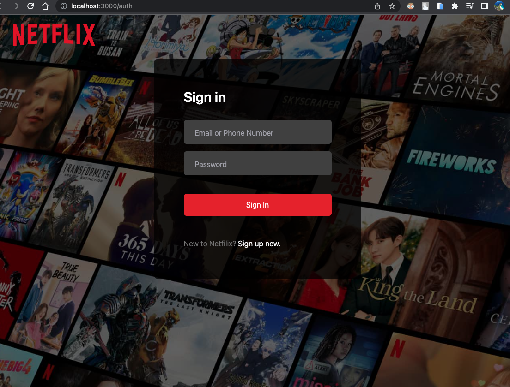

This is a [Next.js](https://nextjs.org/) project bootstrapped with [`create-next-app`](https://github.com/vercel/next.js/tree/canary/packages/create-next-app).

## Getting Started

First, run : 
```
npm install
npm run dev
```

this project using noSQL database : Mongodb. 
You need to setup locally or setup using Atlas.
Edit login setting in <strong>.env</strong> file, then run migrate:

```
npx prisma db push
```

WIP 14/7

